I build LLM systems and measure them properly: every project below has a real
evaluation — accuracy, cost, and latency, not vibes — comparing at least two
models or approaches on real numbers. Several run on zero API budget, entirely
on local compute.

 

## Featured projects

<table>
<tr>
<td width="50%" valign="top">

**[📄 doc-extraction-pipeline](https://github.com/vitormigli/doc-extraction-pipeline)**
 Structured JSON extraction from Brazilian documents (Claude vision + Pydantic), with retry-on-validation-failure.
  

</td>
<td width="50%" valign="top">

**[⚖️ llm-benchmark-ptbr](https://github.com/vitormigli/llm-benchmark-ptbr)**
 Reproducible benchmark of Claude model tiers on 3 real pt-BR tasks, cached so it reruns at zero cost.
  

</td>
</tr>
<tr>
<td width="50%" valign="top">

**[🔍 hybrid-search-ptbr](https://github.com/vitormigli/hybrid-search-ptbr)**
 BM25 + dense embeddings + RRF fusion over Portuguese documents. 100% local, zero API cost.
  

</td>
<td width="50%" valign="top">

**[🤖 sales-agent-evals](https://github.com/vitormigli/sales-agent-evals)**
 Tool-using sales + internal ops agents, evaluated with simulated customer conversations, not single-turn prompts.
  

</td>
</tr>
<tr>
<td width="50%" valign="top">

**[🔒 pii-redaction-ptbr](https://github.com/vitormigli/pii-redaction-ptbr)**
 Detects and redacts CPF, CNPJ, e-mail, phone, and names in pt-BR text before it reaches a log or an LLM prompt.
  

</td>
<td width="50%" valign="top">

**[🧾 invoice-ocr-automation](https://github.com/vitormigli/invoice-ocr-automation)**
 PaddleOCR + rule-based extraction automating invoice intake: auto-approve or route to human review.
  

</td>
</tr>
<tr>
<td colspan="2" valign="top">

**[⚠️ rag-normas-regulamentadoras](https://github.com/vitormigli/rag-normas-regulamentadoras)**
 RAG over real Brazilian workplace-safety regulations (5 gov.br PDFs), hybrid retrieval on a real Postgres + pgvector database (Supabase), citing the exact item or refusing to answer when the context doesn't cover it.
   

</td>
</tr>
<tr>
<td colspan="2" valign="top">

**[🧪 promptcheck](https://github.com/vitormigli/promptcheck)**
 Cassette-based regression testing for LLM prompts — record a real response once, replay it for free forever in CI. YAML test suites, an assertion library, and baseline-vs-current regression detection.
   

</td>
</tr>
<tr>
<td colspan="2" valign="top">

**[🛠️ n8n-sales-agent](https://github.com/vitormigli/n8n-sales-agent)**
 WhatsApp sales agent built entirely in n8n's canvas — RAG over a store's knowledge base (Supabase pgvector), lead capture, human escalation, per-conversation memory. Tested with promptcheck, which caught a real prompt bug before it shipped.
   

</td>
</tr>
<tr>
<td colspan="2" valign="top">

**[🚗 cv-traffic-counter](https://github.com/vitormigli/cv-traffic-counter)**
 YOLOv8 + ByteTrack over OpenCV — detects people/vehicles from any video source (file, webcam, RTSP), counts line crossings by direction, fires zone-entry alerts. Found and root-caused a real tracker ID-fragmentation bug mid-project (one crossing counted 3x); fixed at the tracker config, not papered over in the counting logic.
   

</td>
</tr>
</table>

Every repo ships a one-command demo (`docker compose up`), a CI pipeline, and an
honest README — including where the numbers surprised me and what I'd fix next.
Start with **[ai-project-template](https://github.com/vitormigli/ai-project-template)**
to see the shape every project above follows.

 

**Stack**

 

